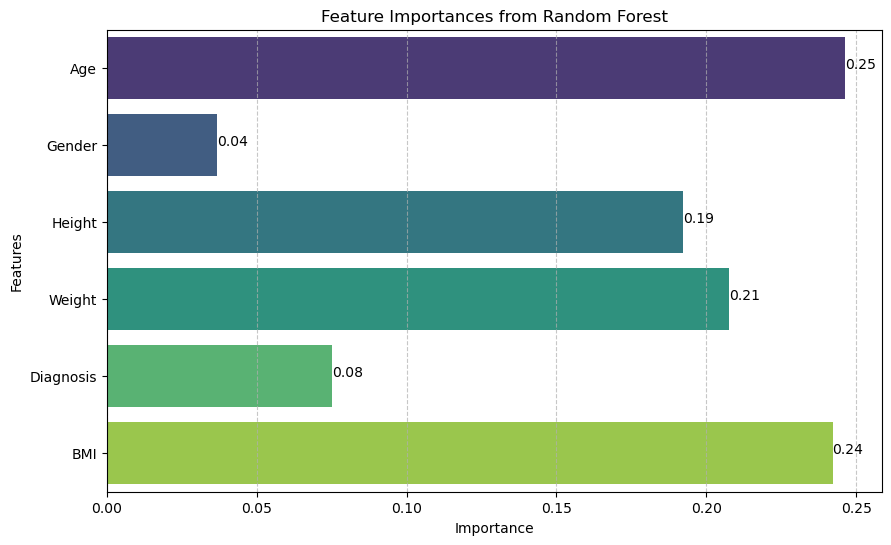
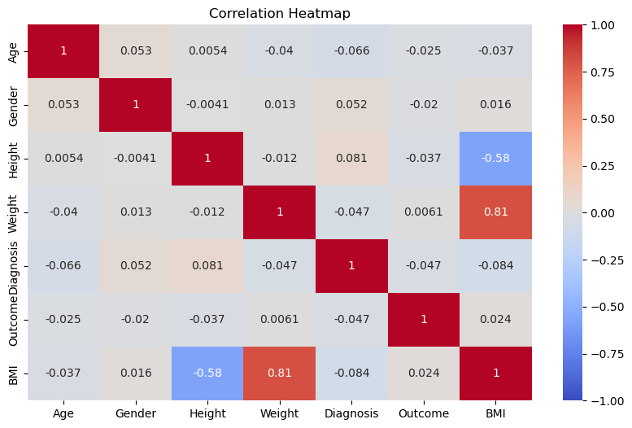

<h1 align="center">Healthcare Data Analysis Project</h1>

This project involves analyzing synthetic patient data to identify trends, improve healthcare delivery, and predict patient outcomes. The project utilizes various machine learning models to derive insights from the data. By leveraging these models, we aim to uncover patterns and relationships within the dataset that can inform better healthcare practices and decision-making.

## Table of Contents
- [Key Objectives](#key-objectives)
- [Data Description](#data-description)
- [Visualizations](#visualizations)
- [Installation](#installation)
- [Results](#results)

## Key Objectives
- **Data Exploration:** Understanding the structure and characteristics of the dataset.
- **Data Preprocessing:** Cleaning and preparing the data for analysis.
- **Model Building:** Developing predictive models to forecast patient outcomes.
- **Insights & Visualizations:** Deriving actionable insights and presenting them through visualizations.

## Data Description
The dataset consists of synthetic data for 1000 patients with the following features:
*   `Age`: Age of the patient in years.
*   `Gender`: Gender of the patient (Male/Female).
*   `Height`: Height of the patient in centimeters.
*   `Weight`: Weight of the patient in kilograms.
*   `Diagnosis`: Medical diagnosis (Diabetes, Hypertension, Heart Disease, Healthy).
*   `Outcome`: Binary outcome (0: No event, 1: Event occurred).

## Visualizations


*Feature Importances from Random Forest*

This bar chart displays the importance of various features in predicting patient outcomes using a Random Forest model. Features like Age, BMI, and Weight have higher importance scores, indicating they are more influential in predicting the outcomes compared to other features like Gender and Diagnosis.



*Correlation Heatmap*

This heatmap shows the correlation coefficients between different features in the dataset. The color intensity represents the strength of the correlation, with red indicating a positive correlation and blue indicating a negative correlation. For example, the strong positive correlation between Weight and BMI (0.81) indicates that as weight increases, BMI also increases.

## Installation 

### Prerequisites
Ensure you have the following installed on your system:
- [Python 3.x](https://www.python.org/downloads/)
- [Jupyter Notebook](https://jupyter.org/install)

### Step 1: Clone the Repository
Clone the repository to your local machine using the following command:
```sh
git clone https://github.com/chrispsang/HealthCare-DataAnalysis.git
cd HealthCare-DataAnalysis
```

### Step 2: Set Up the Environment

It is recommended to use a virtual environment to manage dependencies. You can set up a virtual environment using `venv` or `conda`.

### Using `venv`
1. Create a virtual environment:
    ```sh
    python -m venv venv
    ```
2. Activate the virtual environment:
    - On macOS/Linux:
        ```sh
        source venv/bin/activate
        ```
    - On Windows:
        ```sh
        venv\Scripts\activate
        ```

### Using `conda`
1. Create a conda environment:
    ```sh
    conda create --name healthcare_analysis python=3.x
    ```
2. Activate the conda environment:
    ```sh
    conda activate healthcare_analysis
    ```

### Step 3: Install Dependencies

Install the required packages using the `requirements.txt` file:
```sh
pip install -r requirements.txt
```
### Step 4: Run the Jupyter Notebook
Launch Jupyter Notebook and open the `healthcare.ipynb` file:
```sh
jupyter notebook
```

## Results

The project results include:
*   **Exploratory Data Analysis (EDA):** Summary statistics and visualizations to understand the dataset.
*   **Model Performance:** Evaluation metrics for various machine learning models.
*   **Insights:** Key findings from the analysis, including potential factors influencing patient outcomes.
-------
